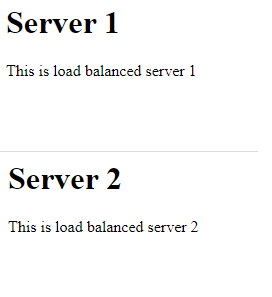

## Resources
- Load Balancing:  https://www.digitalocean.com/community/tutorials/how-to-use-haproxy-to-set-up-http-load-balancing-on-an-ubuntu-vps
- Reference for Extra Credit: [Project2v2 README.md: 9/11/2020 changes](AboutMe-2.2.md)

## Load Balancer Configuration
1) Set up 3 instances with package install of apache2
2) Set up 1 of 3 instance with package install of haproxy
3) Designate hostname to 2 web server instances
4) Configure /etc/haproxy/haproxy.conf file  
  a) global variables, default variables, frontend, backend
5) Enable ssh communication  
  a) Create private key placed on proxy server  
  b) Authorize public key with web servers' .ssh/authorized_keys file  

## Continuous Delivery Configuration
1) Use the private/public key pairing implemented from Load Balancer configuration
2) Initialize a bare bones .git repository
3) Clone bare bones repository into developing environment
4) Create a post-receive hook to run with git push  
  a) Script inside post-receive hook per webserver retreives pushed files and targets /var/www/html as destination directory  
  x) Removed: Script inside post-receive hook will scp git repository version of index.html into web servers' /var/www/html/index  
  
## Today

## 2/12/2020
- Converted post-receive script to scope of individual push to machines
- Before  
  
- After  
  
- Configured template for /.git/hooks/post-receive script
  - touch /home/ubuntu/repository/.git/hooks/post-receive && \
  - echo "scp -i /home/ubuntu/.ssh/haproxy_key /home/ubuntu/index.html ubuntu@webserv1:/var/www/html/index.html" >> /home/ubuntu/repository/.git/hooks/post-receive && \
  - echo "scp -i /home/ubuntu/.ssh/haproxy_key /home/ubuntu/index.html ubuntu@webserv2:/var/www/html/index.html" >> /home/ubuntu/repository/.git/hooks/post-receive && \
- Configured template for bare bones git repository for Proxy Server's Ubuntu user
- Corrected YAML configuration of /etc/hosts server names

## 30/11/2020
- TODO: Quietly produce public/private keypairs
- TODO:  sftp put key into git-server and ldap-server's authorized_keys
- Implemented index.html for all 3 servers
- Cleaned up YAML comments causing template to break
- Tested SFTP to transfer from Proxy to Git server

- Configured YAML template for 2 webserver instances and 1 haproxy instance (project2/CloudFormations/CEG3120-Instance-Template2.YML)
  - Security Group:  22 & 80 from External Network and Private Network Addresses
  - Ubuntu3IPAddress:
  - Ubuntu3Instance:
    - includes apt install haproxy
