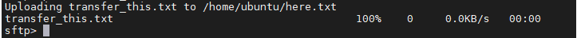

## Today

## 30/11/2020
- Configured YAML template to automate public key dispersal using SFTP  

- Configured YAML template for 2 webserver instances and 1 haproxy instance (project2/CloudFormations/CEG3120-Instance-Template2.YML)
  - Security Group:  22 & 80 from External Network and Private Network Addresses
  - Ubuntu3IPAddress:
  - Ubuntu3Instance:
    - includes apt install haproxy
