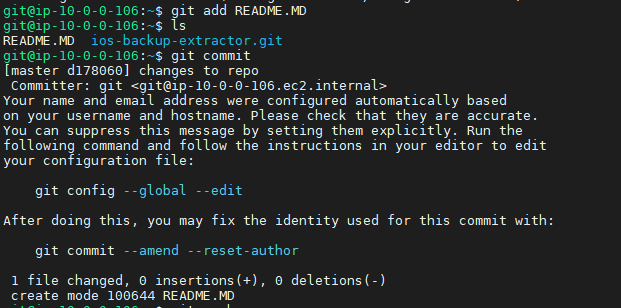
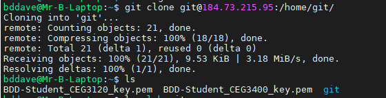
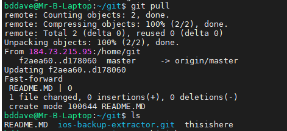
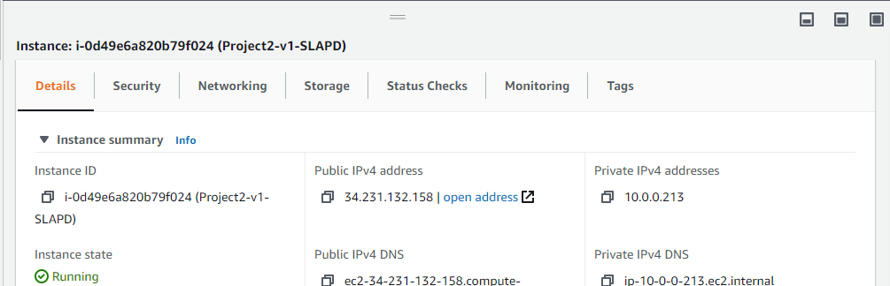
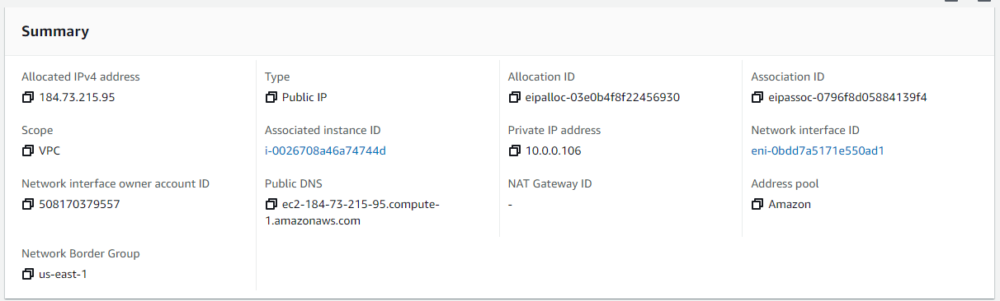
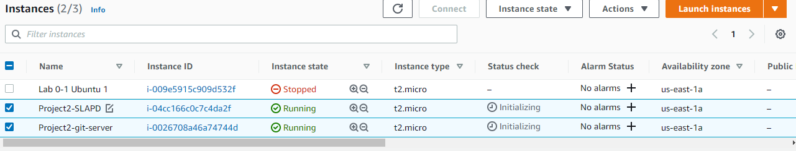
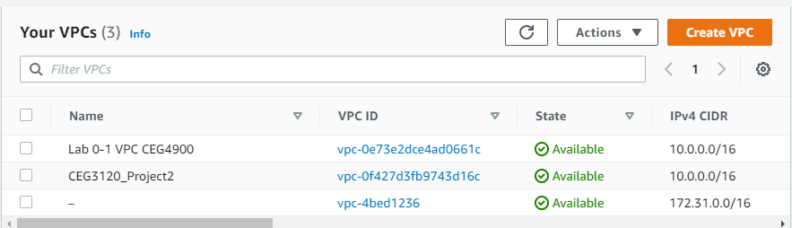

# Project 2:  Working with VPC

## Kanban Board
https://github.com/BDDave-Student/dave-ceg3120-student/projects/1

## Today
## 28/10/2020
- Created local key pair and added public key to git server
- Tested git repository to local machine:  

## 26/10/2020
- Installed barebones git server to AWS machine
- Configured INBOUND port 9418 for GitHub, 389 and 636 for OpenLAPD

## 17/10/2020
- Attached IP to SLAPD instance

- Attached IP to GitHub instance

- Configured Instance settings and launched 2 instances for GitLab and SLAPD

- Created VPC on AWS

