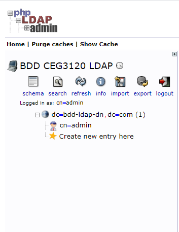
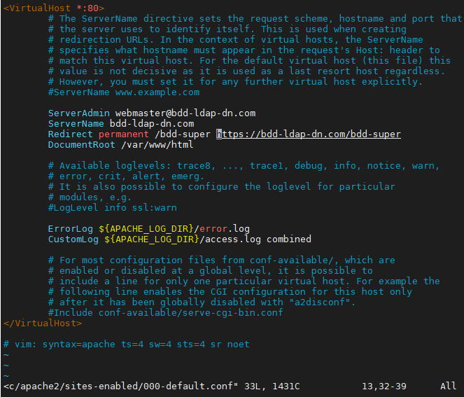
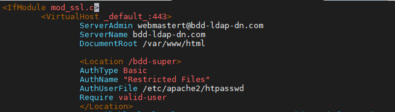
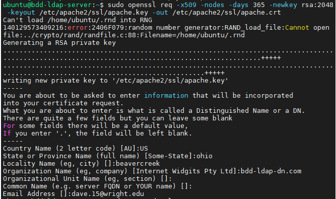
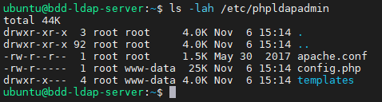
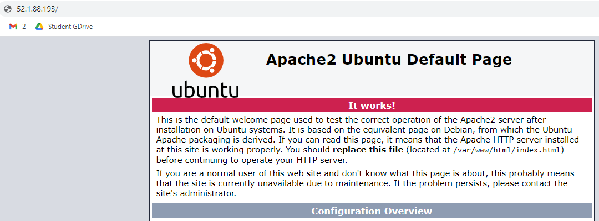

# Project 2:  Working with VPC

## Kanban Board
https://github.com/BDDave-Student/dave-ceg3120-student/projects/1

## Resources
- http://phpldapadmin.sourceforge.net/wiki/index.php/Main_Page
- Ubuntu 14.04: https://www.digitalocean.com/community/tutorials/how-to-install-and-configure-openldap-and-phpldapadmin-on-an-ubuntu-14-04-server
- Ubuntu 18.04: https://www.techrepublic.com/article/how-to-install-phpldapadmin-on-ubuntu-18-04/
- Quick FAQ on config.php:  https://www.clearos.com/clearfoundation/social/community/how-to-connect-with-phpldapadmin-as-administrator

## Files changed to configure PHPLDAPADMIN
Configure phpldapadmin apache related config file to IP or DNS given name
- /etc/phpldapadmin/config.php
- /etc/phpldapadmin/apache.conf  

Create a directory to store certificate created using OpenSSL
- sudo mkdir /etc/apache2/ssl  
- sudo openssl req -x509 -nodes -days 365 -newkey rsa:2048 -keyout /etc/apache2/ssl/apache.key -out /etc/apache2/ssl/apache.crt

Enable Apache2 Module for SSL
- sudo a2enmod ssl

Utilized systemctl to manage Error in config files at specified lines
- /etc/apache2/sites-enabled/000-default.conf
- /etc/apache2/sites-enabled/default-ssl.conf
  - sudo a2ensite default-ssl.conf: Link sites-available/ to sites-enabled/ to modify config file
- sudo service apache2 restart
  - reload apache2 service to enable changes
  
## Today

# 9/11/2020
- Create bash script to create users given a file
  - Script accepts file as param and reads each line
  - Script must be executed as root user (sudo)
  - If param not filled, echo help message
  - Create devops group, if not existing
  - Creates user from file param, if not existing
  - Set GID to devops per user
  - Creates default password for user
  - Outputs User Created with GId and Password
  - Creates quirky "Welcome to the grid" message in each user's directory
  - Chmod/Chown of message file
- Create test userFile for running script
- Discovered server IP uses localhost (127.0.0.1) to log on as admin  
  

# 6/11/2020
- Configured phpldapadmin/config.php file
  - setValue for host is elastic IP (Line 293)
  - setValue for base matching LDAP DNS (Line 300)
  - setValue for bind_ID is admin, DNS (Line 326)
  - setValue for timeout (Line 479)
  - custom config set for Hide_Template_Warning (Line 161)
- Moved phpldapadmin to /var/www/html/
- Installed phpldapadmin packages
- Installed Apache2 and php (ldap and xml) support packages
- Installed slapd packages, ldap-util tools
- Upgraded and Updated Ubuntu 18.04 server
- Purged LDAP Server to reconfigure phpLDAPadmin  

## 6/11/2020 (old: Used for resource and knowledge gathering)
- Add information about LDAPserver domain name to define LDAPServer and set up redirects to point all HTTP requests to the HTTPS interface  
  

- Configured apache.conf to reduce bot attacks on URL location:  /bdd-super (new)
- Created SSL Certificate  

- Configuration of phpldapadmin config file
  - setValue for host is elastic IP (Line 293)
  - setValue for base matching LDAP DNS (Line 300)
  - setValue for bind_ID is admin, DNS (Line 326)
  - setValue for timeout (Line 479)
  - custom config set for Hide_Template_Warning (Line 161)
- Installed phpldapadmin tools to LDAP server  

- Configured Security Group to include All Traffic Inbound from Home IP
- It Works!

